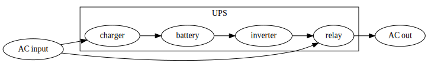
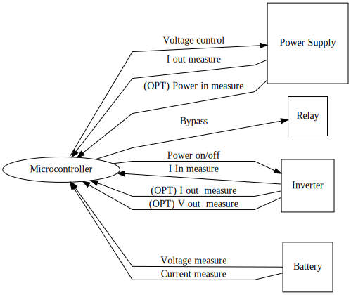

## Power flow

## Microcontroller

## Microcontroller I/O:
### Battery
* Voltage sensor
* Current sensor

### Inverter
* Power control
* Input current sensor
* (Optional) Outuput current sensor
* (Optional) Outuput voltage sensor

### Power Supply
* Voltage control
* Current sensor (IpowerSupply will be calculated by Ibattery + Iinverter)
* (Optional) Input power sensor (Voltage and current sensor)

### Relay
* Control bypass switch
